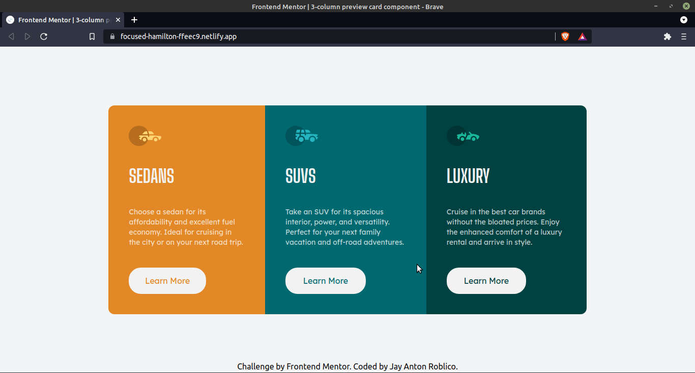
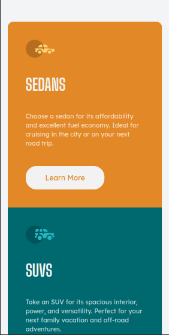

# Frontend Mentor - 3-column preview card component solution

This is a solution to the [3-column preview card component challenge on Frontend Mentor](https://www.frontendmentor.io/challenges/3column-preview-card-component-pH92eAR2-). Frontend Mentor challenges help you improve your coding skills by building realistic projects. 

## Table of contents

- [Frontend Mentor - 3-column preview card component solution](#frontend-mentor---3-column-preview-card-component-solution)
  - [Table of contents](#table-of-contents)
  - [Overview](#overview)
    - [The challenge](#the-challenge)
    - [Screenshot](#screenshot)
    - [Links](#links)
    - [Built with](#built-with)
    - [What I learned](#what-i-learned)
      - [Not Working](#not-working)
      - [Work around, applied in all buttons](#work-around-applied-in-all-buttons)
  - [Author](#author)

## Overview

### The challenge

Users should be able to:

- View the optimal layout depending on their device's screen size
- See hover states for interactive elements

### Screenshot





### Links

- Live Site URL: [Demo](https://focused-hamilton-ffeec9.netlify.app/)

### Built with

- Semantic HTML5 markup
- Mobile-first workflow
- [Tailwind](https://reactjs.org/) - CSS framework

### What I learned

I learned how to use tailwind in mobile first design flow. However I can't use @apply with hover and did a workaround by having hover class in each buttons.

#### Not Working
```css
.btn {
    @apply w-8/12 bg-light-gray font-lexend text-center py-3 rounded-3xl;
    &:hover{

    }
  }
```
#### Work around, applied in all buttons
```html
<button class="btn text-darker-cyan border-2 border-light-gray hover:bg-darker-cyan hover:text-light-gray transition-colors delay-100">Learn More</button>
```

## Author

- Website - [Jay Anton Roblico](https://www.jayantonroblico.tech)
- Frontend Mentor - [@saerdyey](https://www.frontendmentor.io/profile/saerdyey)
- Twitter - [@saerdyey](https://www.twitter.com/saerdyey)
